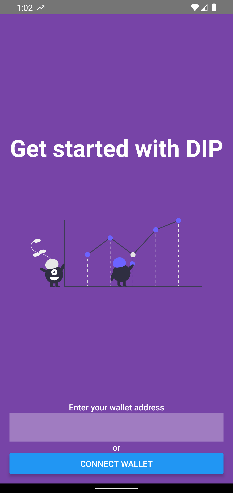
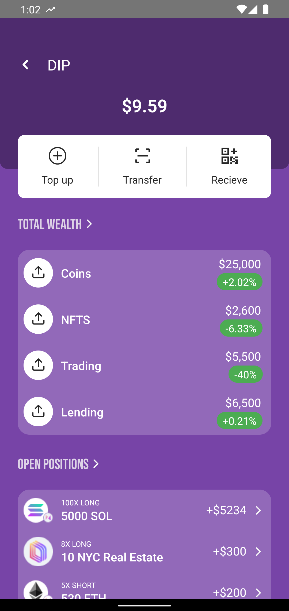
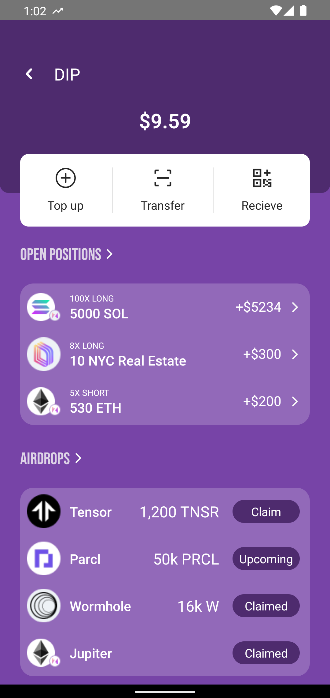

# Dip - Mobile Portfolio Manager for Solana

Dip is the Porfolio Manager for Solana built with love for mobile users.
While the most dApp are built for web, the mobile experience is cumbersome.

Dip is the game changer for Web3 and the beginning of an epic journey toward Mobile 3.

# What Dip can do
- Track your assets spread across those great Solana protocols
- Check health of your borrowings on Marginfi or Kamino and quickly avoid liquidations
- Stake to the validators who is about to airdrop
- Long or Short assets via trading protocols straight from the app

Stay tuned for updates!

This React Native dApp is only fully functional on Android.

## Featured Libarires
- [Mobile Wallet Adapter](https://github.com/solana-mobile/mobile-wallet-adapter/tree/main/js/packages/mobile-wallet-adapter-protocol) for connecting to wallets and signing transactions/messages
- [web3.js](https://solana-labs.github.io/solana-web3.js/) for constructing transactions and an RPC `connection` client.

<table>
  <tr>
    <td align="center">
      
    </td>
    <td align="center">
      
    </td>
    <td align="center">
      
    </td>
  </tr>
</table>

## Prerequisites

If you haven't setup a React Native development environment for Android, you'll need to do that first. Follow the [Prerequisite Setup Guide](https://docs.solanamobile.com/getting-started/development-setup).

Follow the guide to make sure you:
- setup your Android and React Native development environment.
- have an Android device or emulator.
- install an MWA compliant wallet app on your device/emulator.
   
## Usage
1. Install dependencies
- `yarn install` or `npm install`
2. Launch the app on your Android device/emulator
- `npx react-native run-android`

## Troubleshooting

- `Looks like your iOS environment is not properly set`: You can ignore this during template initialization and build the Android app as normal. This template is only compatible with Android.

